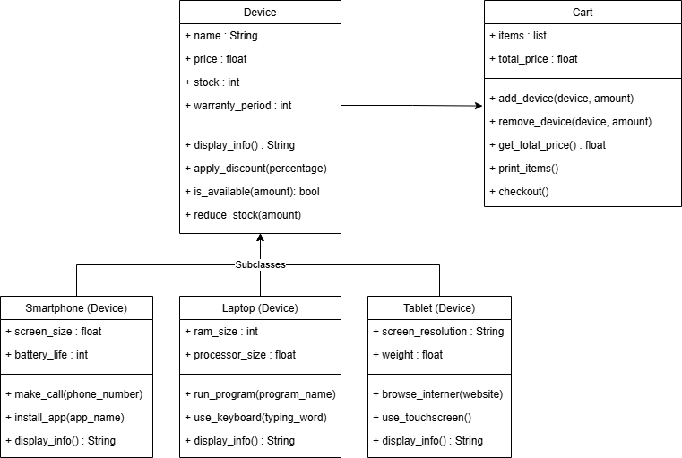

# Electronic Device Shopping Cart
## Overview 
#### This project implements an electronic device shopping cart using Object-Oriented Programming (OOP) concepts, specifically inheritance. The system allows customers to browse and purchase electronic devices such as smartphones, laptops, and tablets, while managing stock and applying discounts.

## Features
#### - Display available devices with details (name, price, stock, warranty, etc.)
#### - Add devices to a shopping cart with quantity management
#### - Remove devices from the shopping cart
#### - Apply discounts to devices
#### - Checkout system that updates stock and calculates total price

## Classes and Structure

### 1. Device (Base Class)

#### Attributes:

#### - name: Name of the device
#### - price: Price of the device
#### - stock: Number of available units
#### - warranty_period: Warranty period in months

#### Methods:

#### - display_info(): Displays device details
#### - __str__(): String representation of the device
#### - apply_discount(discount_percentage): Applies discount to the price
#### - is_available(amount): Checks if the required quantity is available
#### - reduce_stock(amount): Reduces stock after purchase

### 2. Smartphone (Subclass of Device)

#### Additional Attributes:

#### - screen_size: Screen size in inches
#### - battery_life: Battery life in hours

#### Methods:

#### - make_call(): Simulates making a call
#### - install_app(): Simulates installing an app

### 3. Laptop (Subclass of Device)

#### Additional Attributes:

#### - ram_size: RAM size in GB
#### - processor_speed: Processor speed in GHz

#### Methods:

#### - run_program(): Simulates running a program
#### - use_keyboard(): Simulates typing on the keyboard

### 4. Tablet (Subclass of Device)

#### Additional Attributes:

#### - screen_resolution: Screen resolution
#### - weight: Weight in grams

#### Methods:

#### - browse_internet(): Simulates browsing the internet
#### - use_touchscreen(): Simulates using the touchscreen

### 5. Cart

#### Attributes:

#### - items: List of tuples containing a device and the purchased amount
#### - total_price: Total price of all items in the cart

#### Methods:

#### - add_device(device, amount): Adds a device to the cart
#### - remove_device(device, amount): Removes a device from the cart
#### - get_total_price(): Retrieves the total price
#### - print_items(): Prints all items in the cart
#### - checkout(): Processes the purchase and reduces stock

## Unit Testing
#### Unit tests are included for all classes and their respective methods:
#### - TestCart: Test for Cart methods
#### - TestDevice Test for Device methods

## Sample Input/Output
### Creating device, smartphone, laptop, tablet objects
#### Input:
```python
lst = [
    Device('LG Smart tv', 599, 30, 10),
    Smartphone("iPhone 15", 1299, 10, 6.1, 20),
    Laptop("Acer Aspire 3", 899, 4, "2560x1440", 2500),
    Tablet("Lenovo Tab P12", 749, 12, "2000x1200", 600)]

for device in lst:
    print(device.display_info())
```
#### Output:
```ssh
Name: LG Smart tv, Price: 599, Stock: 30, Warranty period: 10 months
Name: iPhone 15, Price: 1299$, Stock: 10, Warranty period: 12 months, Screen size: 6.1 inches,Battery life: 20 hours
Name: Acer Aspire 3, Price: 899$, Stock: 4, Warranty period: 12 months, RAM size: 2560x1440 GB, Processor size: 2500 GHz
Name: Lenovo Tab P12, Price: 749$, Stock: 12, Warranty period: 12 months, Screen resolution: 2000x1200, Weight: 600 grams
```

### Apply discount for device 
#### Input:
```python
device1 = Device('LG Smart tv', 599, 30, 10)
device1.apply_discount(30)
print(f'{device1.name} price with 30% discount is {device1.price}$')
```
#### Output:
```ssh
LG Smart tv price with 30% discount is 419.3$
```

### Check if device is available in some amount
#### Input:
```python
device1 = Device('LG Smart tv', 599, 30, 10)

if device1.is_available(5):
    print(f'{device1.name} is available in 5')
else:
    print(f'There are only {device1.stock} units left')
```
#### Output:
```ssh
LG Smart tv is available in 5
```

### Reduce stock of device
#### Input:
```python
device1 = Device('LG Smart tv', 599, 10, 10)
device1.reduce_stock(8)
print(f'There left {device1.stock} of {device1.name}')
```
#### Output:
```ssh
There left 2 of LG Smart tv
```

### Adding devices to the Cart
#### Input:
```python
devices = [
    Smartphone("iPhone 15", 1299, 10, 6.1, 20),
    Smartphone("Samsung Galaxy S23", 1199, 15, 6.5, 25),
    Smartphone("Google Pixel 8", 999, 12, 6.3, 24),
    Laptop("MacBook Pro 16", 2499, 5, "3456x2234", 2000),
    Laptop("Dell XPS 15", 1899, 7, "3840x2400", 1800),
    Tablet("Samsung Galaxy Tab S9", 1099, 8, "2560x1600", 567),
    Tablet("Microsoft Surface Pro 9", 999, 9, "2880x1920", 879)
]

cart = Cart()
cart.add_device(devices[1], 1)
```
#### Output:
```ssh
Added to cart: 1 of Name: Samsung Galaxy S23, Price: 1199$, Stock: 15, Warranty period: 12 months, Screen size: 6.5 inches,Battery life: 25 hours
```

### Get total price of devices in the Cart
#### Input:
```python
devices = [
    Smartphone("iPhone 15", 1299, 10, 6.1, 20),
    Smartphone("Samsung Galaxy S23", 1199, 15, 6.5, 25),
    Smartphone("Google Pixel 8", 999, 12, 6.3, 24),
    Laptop("MacBook Pro 16", 2499, 5, "3456x2234", 2000),
    Laptop("Dell XPS 15", 1899, 7, "3840x2400", 1800),
    Tablet("Samsung Galaxy Tab S9", 1099, 8, "2560x1600", 567),
    Tablet("Microsoft Surface Pro 9", 999, 9, "2880x1920", 879)
]

cart = Cart()
cart.add_device(devices[1], 1)
print(f'The price is {cart.get_total_price()}$')
```
#### Output:
```ssh
Added to cart: 1 of Name: Samsung Galaxy S23, Price: 1199$, Stock: 15, Warranty period: 12 months, Screen size: 6.5 inches,Battery life: 25 hours
The price is 1199$
```
### Remove device from the Cart
#### Input:
```python
devices = [
    Smartphone("iPhone 15", 1299, 10, 6.1, 20),
    Smartphone("Samsung Galaxy S23", 1199, 15, 6.5, 25),
    Smartphone("Google Pixel 8", 999, 12, 6.3, 24),
    Laptop("MacBook Pro 16", 2499, 5, "3456x2234", 2000),
    Laptop("Dell XPS 15", 1899, 7, "3840x2400", 1800),
    Tablet("Samsung Galaxy Tab S9", 1099, 8, "2560x1600", 567),
    Tablet("Microsoft Surface Pro 9", 999, 9, "2880x1920", 879)
]

cart = Cart()
cart.add_device(devices[1], 1)
cart.add_device(devices[3], 1)
cart.remove_device(devices[3], 1)
print(f'The price is {cart.get_total_price()}$')
```
#### Output:
```ssh
Added to cart: 1 of Name: Samsung Galaxy S23, Price: 1199$, Stock: 15, Warranty period: 12 months, Screen size: 6.5 inches,Battery life: 25 hours
Added to cart: 1 of Name: MacBook Pro 16, Price: 2499$, Stock: 5, Warranty period: 12 months, RAM size: 3456x2234 GB, Processor size: 2000 GHz
MacBook Pro 16 is not in the cart.
The price is 1199$
```

### Print all devices in the Cart
#### Input:
```python
devices = [
    Smartphone("iPhone 15", 1299, 10, 6.1, 20),
    Smartphone("Samsung Galaxy S23", 1199, 15, 6.5, 25),
    Smartphone("Google Pixel 8", 999, 12, 6.3, 24),
    Laptop("MacBook Pro 16", 2499, 5, "3456x2234", 2000),
    Laptop("Dell XPS 15", 1899, 7, "3840x2400", 1800),
    Tablet("Samsung Galaxy Tab S9", 1099, 8, "2560x1600", 567),
    Tablet("Microsoft Surface Pro 9", 999, 9, "2880x1920", 879)
]

cart = Cart()
cart.add_device(devices[1], 1)
cart.add_device(devices[3], 1)
print(cart.print_items())
```
#### Output:
```ssh
Added to cart: 1 of Name: Samsung Galaxy S23, Price: 1199$, Stock: 15, Warranty period: 12 months, Screen size: 6.5 inches,Battery life: 25 hours
Added to cart: 1 of Name: MacBook Pro 16, Price: 2499$, Stock: 5, Warranty period: 12 months, RAM size: 3456x2234 GB, Processor size: 2000 GHz
1 x Samsung Galaxy S23 - $1199 each
1 x MacBook Pro 16 - $2499 each
```
### Checkout the Cart
#### Input:
```python
devices = [
    Smartphone("iPhone 15", 1299, 10, 6.1, 20),
    Smartphone("Samsung Galaxy S23", 1199, 15, 6.5, 25),
    Smartphone("Google Pixel 8", 999, 12, 6.3, 24),
    Laptop("MacBook Pro 16", 2499, 5, "3456x2234", 2000),
    Laptop("Dell XPS 15", 1899, 7, "3840x2400", 1800),
    Tablet("Samsung Galaxy Tab S9", 1099, 8, "2560x1600", 567),
    Tablet("Microsoft Surface Pro 9", 999, 9, "2880x1920", 879)
]

cart = Cart()
cart.add_device(devices[1], 1)
cart.add_device(devices[3], 1)
print(cart.checkout())
print(cart.items)
```
#### Output:
```ssh
Added to cart: 1 of Name: Samsung Galaxy S23, Price: 1199$, Stock: 15, Warranty period: 12 months, Screen size: 6.5 inches,Battery life: 25 hours
Added to cart: 1 of Name: MacBook Pro 16, Price: 2499$, Stock: 5, Warranty period: 12 months, RAM size: 3456x2234 GB, Processor size: 2000 GHz
Receipt
1 x Samsung Galaxy S23 - $1199
1 x MacBook Pro 16 - $2499
Total Amount: $3698
[]
```

## UML



